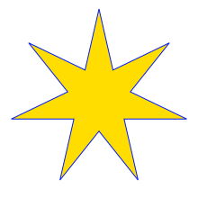

# moto-design SVG Generators

Programs for generating Scalable Vector Graphics image files for camouflage blobs, user defined stars, USA flags, and Yamaha like racing srtipes.

## blob-generator

Generates SVG file of camouflage blobs.

### Blob Samples


#### With the following parameters:
```
blob-generator \
 --node-count-min 8 \
 --node-count-max 16 \
 --radius-min 18 \
 --radius-max 70 \
 --sector_min 20 \
 --grid-columns 180 \
 --grid-rows 180 \
 --grid-width 60 \
 --grid-wiggle 56
```


## star-generator

Generates SVG file of stars.

### Star Samples




## flag-generator

Generates SVG file of American flags.

### Flag Samples


## stripe-generator

Generates SVG file of Yamaha like stripes.

### Stripe Samples


## Building

To build use commands like these:

./bootstrap<br />
./configure<br />
make<br />
make install

## Licence & Usage

All files in the [svg-generators project](https://github.com/glevand/svg-generators), unless
otherwise noted, are covered by an
[MIT Plus License](https://github.com/glevand/svg-generators/blob/master/mit-plus-license.txt).
The text of the license describes what usage is allowed.
